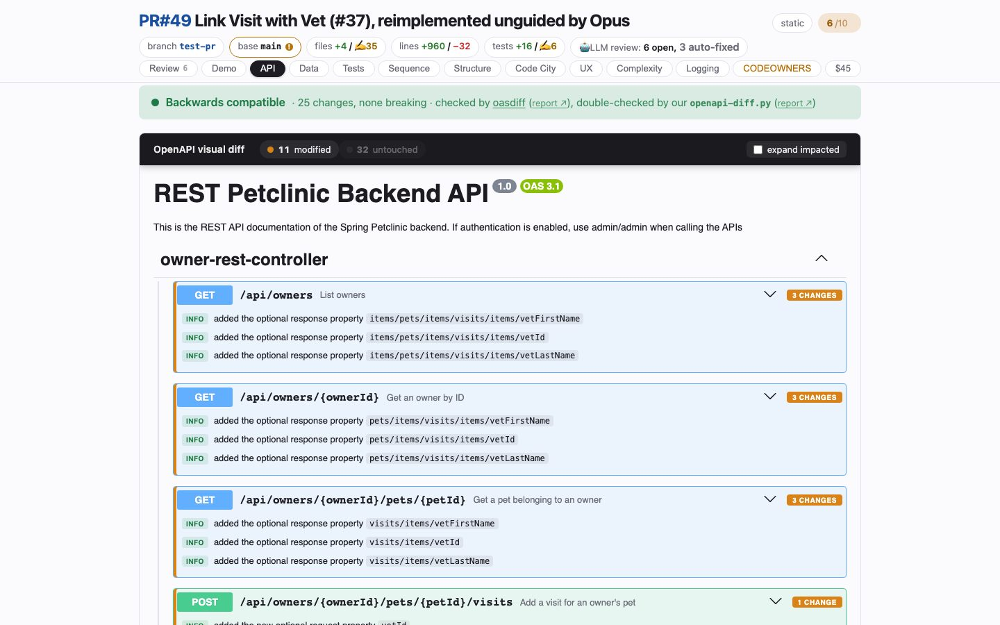

# API
<!-- panel: api -->

> Every REST operation and schema the branch moved, each classified breaking / additive / changed / cosmetic — and a verdict from an independent differ on top.

<!-- shot:begin -->
<!-- generated by `skills/human-review/scripts/readme-tour.py` on every publish of the featured snapshot — edits between these markers are overwritten -->

[Open this tab in the live demo](https://victorrentea.github.io/human-review/demo/review.html#api) · [all tabs](../../README.md#a-tour-one-tab-at-a-time)
<!-- shot:end -->

## What you see

- **The verdict band** — *backwards compatible* or *breaking*, from `oasdiff`, double-checked
  by this skill's own `openapi-diff.py`. When the two disagree, that disagreement is the line
  to read first.
- **The OpenAPI visual diff** — every operation the branch touched, expanded, with each change
  labelled; the untouched ones folded away.
- **The effective payload** — `$ref`s resolved, so a property that moved in a shared schema
  shows up at every operation that serves it, not once in a place nobody looks.

It reads the contract, not the handler: a `PUT` that starts *clearing* a field looks
additive to any structural differ. The raw unified diff rides along for that reason.

## What it needs

- An OpenAPI spec the project generates (`human-review.json` names it), **PyYAML**, and a JVM
  or Docker. `oasdiff` resolves what the fallback cannot.

## Deeper

- [The OpenAPI contract differ](../../README.md#the-openapi-contract-differ)
- Produced by [`openapi-compat.py`](../../skills/human-review/scripts/openapi-compat.py),
  [`openapi-diff.py`](../../skills/human-review/scripts/openapi-diff.py) and
  [`openapi-visual-diff.py`](../../skills/human-review/scripts/openapi-visual-diff.py)
