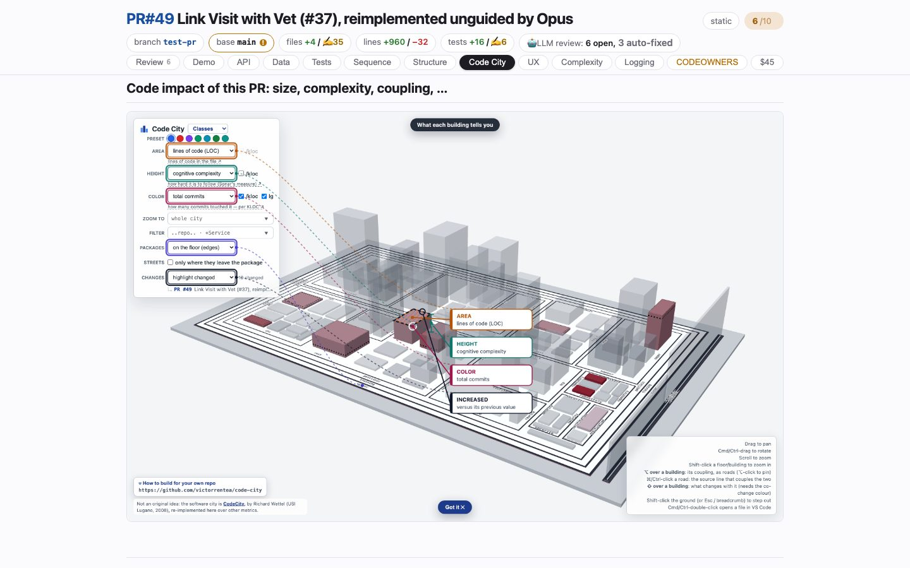

# Code City
<!-- panel: city -->

> The change lit up in a 3D Code City: every class a building, sized by lines of code, raised by complexity, coloured by churn.

<!-- shot:begin -->
<!-- generated by `skills/human-review/scripts/readme-tour.py` on every publish of the featured snapshot — edits between these markers are overwritten -->

[Open this tab in the live demo](https://victorrentea.github.io/human-review/demo/review.html#city) · [all tabs](../../README.md#a-tour-one-tab-at-a-time)
<!-- shot:end -->

## What you see

- **The city** — packages are districts, classes are buildings. Area is lines of code,
  height is cognitive complexity, colour is how often it changed; every knob is on the
  panel at the left.
- **The branch, highlighted** — the buildings this change set touched stand out of the
  skyline; the rest is context.
- It is live: drag to pan, scroll to zoom, ⌥ over a building for its couplings,
  ⌘-double-click to open the file in VS Code.

## What it needs

- The project's Code City render, named in `human-review.json`
  ([victorrentea/code-city](https://github.com/victorrentea/code-city) builds one).

## Deeper

- Captured by [`capture-codecity.sh`](../../skills/human-review/scripts/capture-codecity.sh),
  regenerated by [`regenerate-codecity.sh`](../../skills/human-review/scripts/regenerate-codecity.sh)
