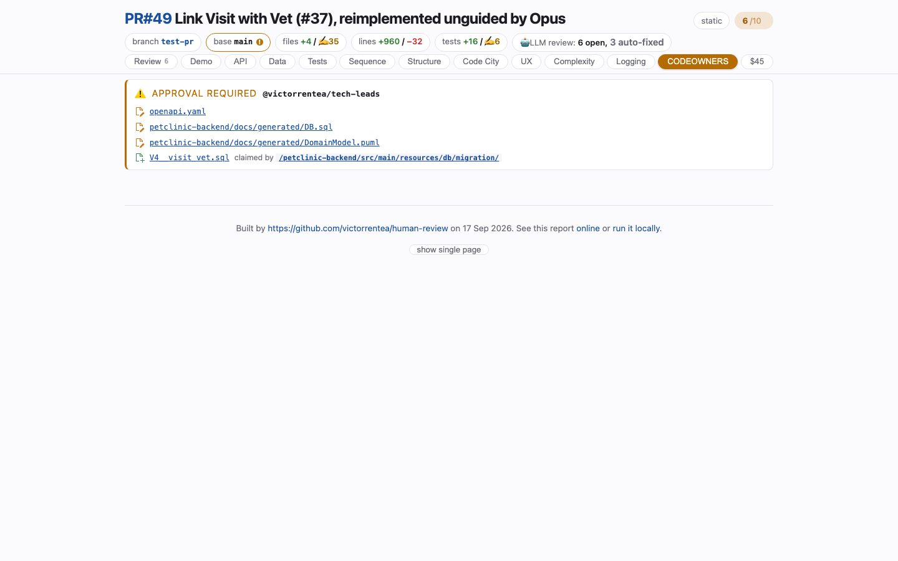

# CODEOWNERS
<!-- panel: owners -->

> Who has to approve this, and whether the merge is blocked — asked of your `CODEOWNERS` file at review time, not at merge time.

<!-- shot:begin -->
<!-- generated by `skills/human-review/scripts/readme-tour.py` on every publish of the featured snapshot — edits between these markers are overwritten -->

[Open this tab in the live demo](https://victorrentea.github.io/human-review/demo/review.html#owners) · [all tabs](../../README.md#a-tour-one-tab-at-a-time)
<!-- shot:end -->

## What you see

- **APPROVAL REQUIRED** and the owner it waits for, or a quiet all-clear.
- **Which files caused it**, and **which rule claimed them** — the API contract, a migration,
  a generated schema.
- The tab turns amber in the strip when an approval is needed, so it is seen before the
  diff is read.

It is not a gate and approves nothing. It answers *will this pull request wait for
somebody, and for whom* — early enough to matter.

## What it needs

- A `CODEOWNERS` file (GitHub or GitLab semantics, stated on the page).

## Deeper

- Produced by [`codeowners-check.py`](../../skills/human-review/scripts/codeowners-check.py)
