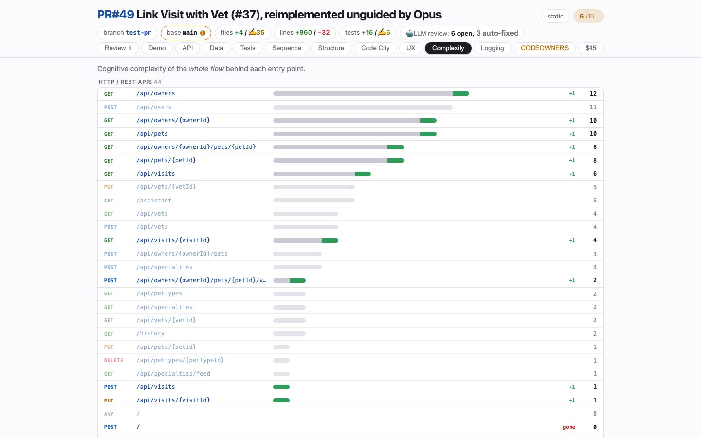

# Complexity
<!-- panel: complexity -->

> The before → after of every entry point: cognitive complexity of the whole flow behind each REST endpoint, and what this branch added to it.

<!-- shot:begin -->
<!-- generated by `skills/human-review/scripts/readme-tour.py` on every publish of the featured snapshot — edits between these markers are overwritten -->

[Open this tab in the live demo](https://victorrentea.github.io/human-review/demo/review.html#complexity) · [all tabs](../../README.md#a-tour-one-tab-at-a-time)
<!-- shot:end -->

## What you see

- **Every entry point, ranked** — the grey bar is the flow's complexity before the branch,
  the green tail is what it added, the number is where it stands now.
- **Faded rows** are endpoints the branch did not touch, there for scale; `gone` marks one
  it removed.
- The score is Cognitive Complexity, summed over every method reachable from the handler,
  so a heavier helper three calls deep shows up at the endpoint that pays for it.

## What it needs

- Java sources. The measurement is read from source by the skill itself; nothing in your
  project has to produce it.

## Deeper

- Produced by [`endpoint-complexity.py`](../../skills/human-review/scripts/endpoint-complexity.py)
  and [`endpoint-complexity-delta.py`](../../skills/human-review/scripts/endpoint-complexity-delta.py)
