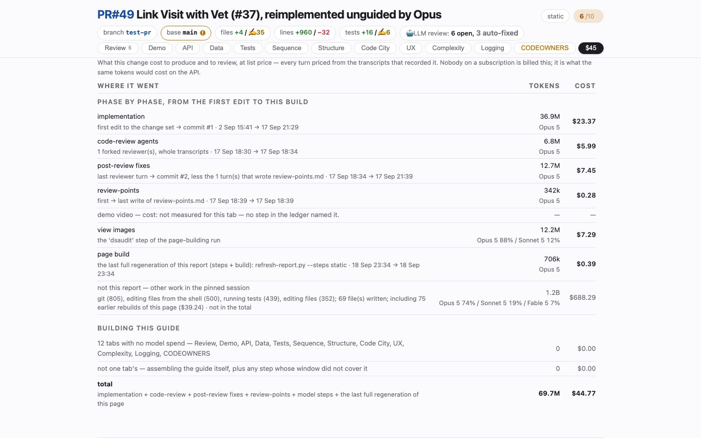

# Cost
<!-- panel: cost -->

> What this change cost to write and to review, at list price — every turn priced from the transcripts that recorded it, per phase and per tab. The tab is named after the total.

<!-- shot:begin -->
<!-- generated by `skills/human-review/scripts/readme-tour.py` on every publish of the featured snapshot — edits between these markers are overwritten -->

[Open this tab in the live demo](https://victorrentea.github.io/human-review/demo/review.html#cost) · [all tabs](../../README.md#a-tour-one-tab-at-a-time)
<!-- shot:end -->

## What you see

- **Phase by phase** — implementation, the code-review agents, the fixes after them,
  `review-points.md`, the demo, the page build — tokens, model mix and dollars for each.
- **Building this guide** — which tabs spent anything, and which did not.
- **The total** — the same number the tab is named after.

Nobody on a subscription is billed this; it is what the same tokens would cost on the API.
Subagents count, and messages are deduplicated, so a streamed turn is not billed twice.

## What it needs

- Claude Code's own session transcripts, which it already writes.

## Deeper

- [Rerun, in the header](../../README.md#rerun-in-the-header) — what the paid rerun costs, measured
- Produced by [`review-cost.py`](../../skills/human-review/scripts/review-cost.py)
