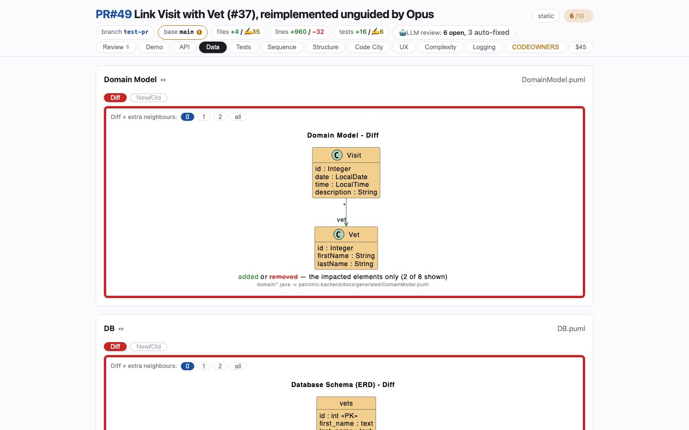

# Data
<!-- panel: data -->

> The database and domain-model deltas — added in green, removed in red and struck — trimmed to what changed.

<!-- shot:begin -->
<!-- generated by `skills/human-review/scripts/readme-tour.py` on every publish of the featured snapshot — edits between these markers are overwritten -->

[Open this tab in the live demo](https://victorrentea.github.io/human-review/demo/review.html#data) · [all tabs](../../README.md#a-tour-one-tab-at-a-time)
<!-- shot:end -->

## What you see

- **Domain Model** and **DB** diagrams, each drawn as a *diff*: only the elements the branch
  touched, green for added, red and struck for removed, titled "… - Diff" so a picture that
  escapes the page still says it is a change.
- **Diff + extra neighbours: 0 · 1 · 2 · all** — widen the radius around the change until it
  is legible in context.
- **Diff / New/Old** — flip to the whole diagram before and after.
- A hand-drawn `.drawio.png` conceptual model, if the project keeps one, diffed by the
  identity of each box rather than by pixels.

## What it needs

- `plantuml`, and the `.puml` diagrams your project already generates and commits.

## Deeper

- [The PlantUML differs](../../README.md#the-plantuml-differs)
- [The draw.io differ](../../README.md#the-drawio-differ)
