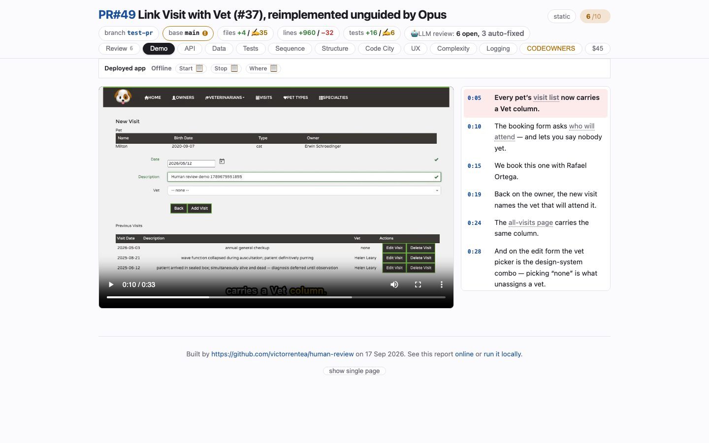

# Demo
<!-- panel: behaviour -->

> A Playwright recording of the feature working, narrated, with every caption a timestamp you can jump to.

<!-- shot:begin -->
<!-- generated by `skills/human-review/scripts/readme-tour.py` on every publish of the featured snapshot — edits between these markers are overwritten -->

[Open this tab in the live demo](https://victorrentea.github.io/human-review/demo/review.html#behaviour) · [all tabs](../../README.md#a-tour-one-tab-at-a-time)
<!-- shot:end -->

## What you see

- **The feature film** — the browser suite's own flow through the new behaviour, recorded
  against the branch's build, with burned-in captions and a voice-over.
- **The script beside it** — one line per beat (`0:05`, `0:10`, …). Click one to seek the
  film there; the line being spoken is highlighted while it plays.
- **Deployed app** — Start, Stop and Where for the build the film was recorded against, so
  you can click through it yourself. On a served page they run; off disk (and on this demo)
  they copy the command.

## What it needs

- A filmable browser suite and an `app` block in `human-review.json` that brings the
  branch up — the run starts it, films, and takes it down.
- **ffmpeg** and a TTF font for the captions.

## Deeper

- [Commands: text + one glyph](../../README.md#commands-text--one-glyph) — why the row's
  buttons run on a served page and copy everywhere else
- Built by [`hrbuild/tabs/demo.py`](../../skills/human-review/scripts/hrbuild/tabs/demo.py),
  recorded by [`record-feature-video.sh`](../../skills/human-review/scripts/record-feature-video.sh)
