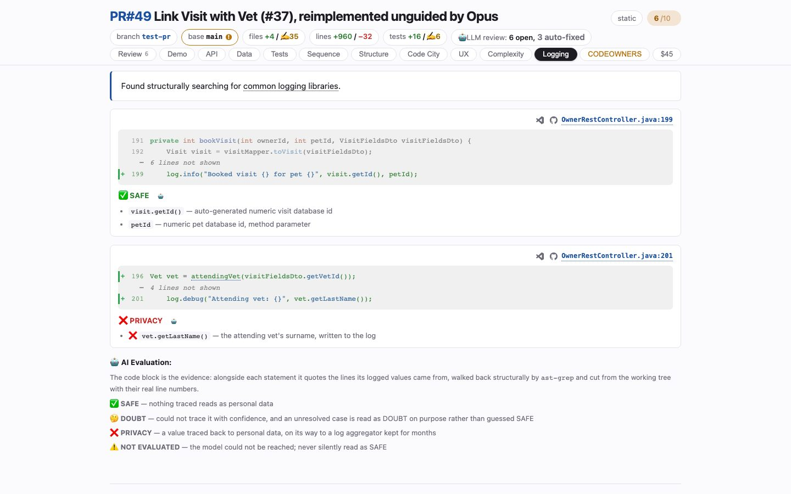

# Logging
<!-- panel: logging -->

> What the change set will say for itself in production — every logging statement it adds or changes, found by syntax, not by grep, and whether a value it logs is personal data.

<!-- shot:begin -->
<!-- generated by `skills/human-review/scripts/readme-tour.py` on every publish of the featured snapshot — edits between these markers are overwritten -->

[Open this tab in the live demo](https://victorrentea.github.io/human-review/demo/review.html#logging) · [all tabs](../../README.md#a-tour-one-tab-at-a-time)
<!-- shot:end -->

## What you see

- **Every new or changed log line**, cut from the working tree with the lines its values
  came from, each a click into your editor or onto GitHub.
- **A verdict per statement** — SAFE, DOUBT, PRIVACY, or NOT EVALUATED — with the value that
  earned it: `vet.getLastName()` is a surname on its way to a log aggregator kept for months.
- An unresolved case reads DOUBT on purpose, never a guessed SAFE.

## What it needs

- **`ast-grep`** — the only way to tell `log.info(x)` from `Math.log(x)`. The privacy verdicts
  are the one model call on this tab, and they are cached.

## Deeper

- Produced by [`logextract.py`](../../skills/human-review/scripts/logextract.py), rendered by
  [`hrbuild/tabs/logging.py`](../../skills/human-review/scripts/hrbuild/tabs/logging.py)
