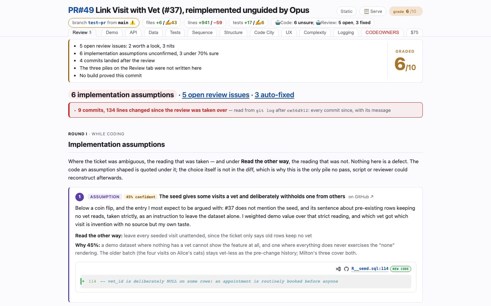

# Review
<!-- panel: review -->

> One list, read off the branch's own `review-points.md`: what the agent declined and why, what it fixed (with the diff), and what it assumed where the ticket was ambiguous — each stamped with the reviewer that raised it, under a band saying what changed since.

<!-- shot:begin -->
<!-- generated by `skills/human-review/scripts/readme-tour.py` on every publish of the featured snapshot — edits between these markers are overwritten -->

[Open this tab in the live demo](https://victorrentea.github.io/human-review/demo/review.html#review) · [all tabs](../../README.md#a-tour-one-tab-at-a-time)
<!-- shot:end -->

## What you see

- **The headline** — open review issues · auto-fixed · implementation assumptions, each a
  jump to its pile.
- **The aftermath band** — what landed *after* the review commit: how many commits, how many
  lines, each commit's sha and subject. Red when a hand-written file moved, grey when only
  generated files did.
- **Open review issues** — what the agent read and said no to, with its reason, and the
  reviewer (`/code-review`, or the agent against itself) that raised it.
- **Auto-fixed** — what it repaired because the review was right, with the diff of the fix.
- **Assumptions** — which reading of an ambiguous ticket it chose, and the one it did not.
  This is the pile nobody else can write, because it is not in the diff.

Nothing on this tab is written by the agent building the page: it is parsed from
`review-points.md`, committed by `/record-review`. A branch without one says so, loudly,
instead of reading as "nothing outstanding".

## Deeper

- [Two commands: one decides, the other writes it up](../../README.md#two-commands-one-decides-the-other-writes-it-up)
- [What changed after the agent stopped](../../README.md#what-changed-after-the-agent-stopped)
- Built by [`hrbuild/tabs/review.py`](../../skills/human-review/scripts/hrbuild/tabs/review.py)
