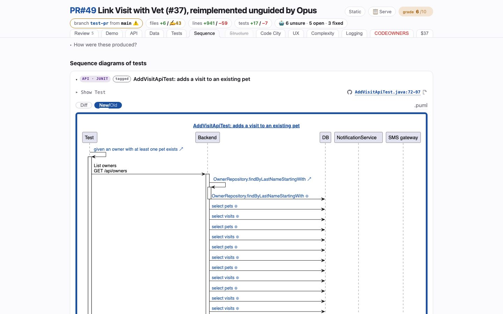

# Sequence
<!-- panel: sequence -->

> Sequence diagrams recorded from real traces of real test runs, each beside the test that produced it — and the tests tagged for tracing that came back without one.

<!-- shot:begin -->
<!-- generated by `skills/human-review/scripts/readme-tour.py` on every publish of the featured snapshot — edits between these markers are overwritten -->
<a href="https://victorrentea.github.io/human-review/demo/review.html#sequence"></a>

[Open this tab in the live demo](https://victorrentea.github.io/human-review/demo/review.html#sequence) · [all tabs](../../README.md#a-tour-one-tab-at-a-time)
<!-- shot:end -->

## What you see

- **One fold per test** — tagged API · JUnit, UI · Playwright or UI · Gherkin. Open one and
  the diagram that test's run actually produced is beside its source.
- **Diff / New/Old** — what the branch changed in that flow: new calls green, calls that
  disappeared red and struck.
- Nothing is drawn by hand: a call is on the diagram because it *happened* during the test.

## What it needs

- Tests tagged for tracing, and the project's traced test run named in `human-review.json`.
- Somewhere for the traces to land. Best: `steps.sequence.app`, the block `video.app` is,
  whose `up` builds the commit under review **with its own trace store** and whose `vars`
  command prints every host-picked address as `NAME=value` lines; they are exported to the
  commands, and `down` runs in a `finally`. Several branches can then be traced at once, each
  into its own Tempo, from a freshly seeded database. `requires` (URLs or `tcp://host:port`,
  `{NAME}` expanded from `vars`) is probed before any command runs — after `up` with an
  `app`, before anything without one — and a miss is a skip naming what did not answer:

  ```json
  "sequence": {
    "app": {
      "up": "./start-docker.sh up --ref {sha} --name petclinic-{shortsha}-otel --otel --fresh",
      "vars": "./start-docker.sh ports petclinic-{shortsha}-otel",
      "down": "./start-docker.sh down petclinic-{shortsha}-otel"
    },
    "requires": [{"url": "{GRAFANA_URL}/api/health", "what": "Grafana"},
                 {"url": "{OTEL_EXPORTER_OTLP_ENDPOINT}/v1/traces", "what": "OTLP collector"}],
    "commands": ["cd petclinic-test && ./run-tests-with-tracing.sh"]
  }
  ```

## Deeper

- [The PlantUML differs](../../README.md#the-plantuml-differs) — the sequence differ keeps
  order, because the same arrow twice is two events
- Built by [`hrbuild/tabs/sequence.py`](../../skills/human-review/scripts/hrbuild/tabs/sequence.py)
