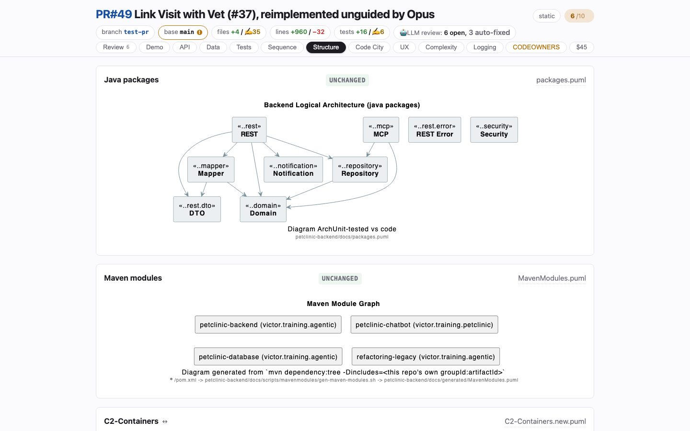

# Structure
<!-- panel: packages -->

> The package and container delta — or, when nothing moved, the current diagrams as context, marked unchanged.

<!-- shot:begin -->
<!-- generated by `skills/human-review/scripts/readme-tour.py` on every publish of the featured snapshot — edits between these markers are overwritten -->

[Open this tab in the live demo](https://victorrentea.github.io/human-review/demo/review.html#packages) · [all tabs](../../README.md#a-tour-one-tab-at-a-time)
<!-- shot:end -->

## What you see

- **Java packages** and **Maven modules** — the project's own diagrams, diffed, or stamped
  UNCHANGED so you know they were checked rather than forgotten.
- **C2 Containers** — the C4 container view, not drawn at all: it is projected from the
  recorded sequence diagrams, so a call to a new service puts a box and a line here because
  the call happened.

## What it needs

- `plantuml`, and the architecture `.puml` files your project generates. The container
  view needs the Sequence tab's recorded diagrams.

## Deeper

- [The PlantUML differs](../../README.md#the-plantuml-differs)
- Produced by [`c2-from-sequence.py`](../../skills/human-review/scripts/c2-from-sequence.py)
