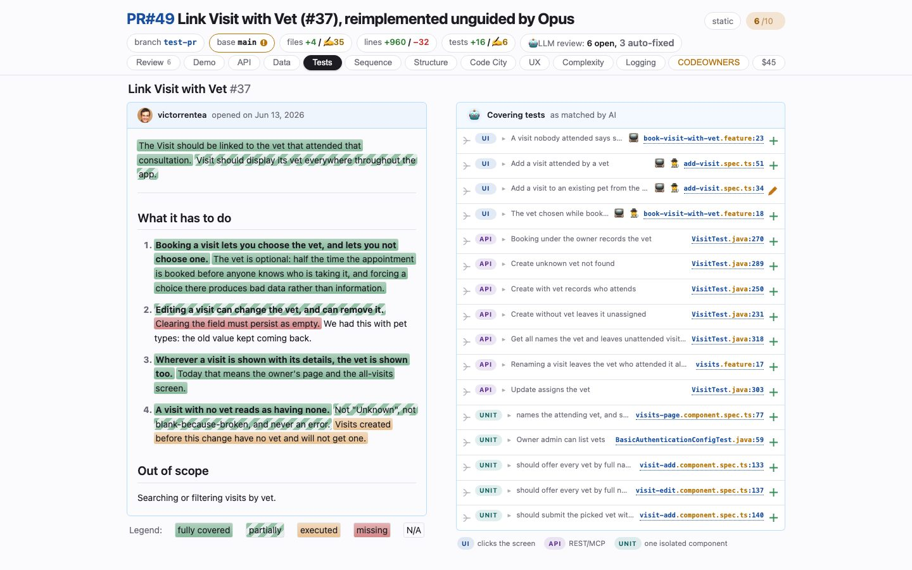

# Tests
<!-- panel: requirements -->

> What the change set was supposed to do, the tests that pin each sentence of it, and what the branch did to the test run — including the tests it stopped running without deleting.

<!-- shot:begin -->
<!-- generated by `skills/human-review/scripts/readme-tour.py` on every publish of the featured snapshot — edits between these markers are overwritten -->

[Open this tab in the live demo](https://victorrentea.github.io/human-review/demo/review.html#requirements) · [all tabs](../../README.md#a-tour-one-tab-at-a-time)
<!-- shot:end -->

## What you see

- **The ticket, highlighted** — every sentence of it coloured by how well it is pinned:
  fully covered, partially, only executed, or missing.
- **Covering tests** — the tests matched to each sentence, tagged UI / API / UNIT, each
  marked new (+) or edited (✎), each a click to its source line.
- **The test ledger** — how many tests entered the run and how many left it. A test can be
  deleted, commented out or `@Disabled`; all three cost the run the same test, and only the
  first shows up in a diff.
- **Recordings** — each Playwright test opens on Playwright's own trace viewer, inside the
  tab: every action with the page either side of it, the DOM, the console and the network.

## What it needs

- Your project's test commands in `human-review.json`; Playwright with `--trace on` for the
  recordings. The matching of tests to sentences is the one part a model writes.

## Deeper

- [Rerun, in the header](../../README.md#rerun-in-the-header) — the free rerun and the paid one
  that rewrites this matrix
- Built by [`hrbuild/tabs/tests.py`](../../skills/human-review/scripts/hrbuild/tabs/tests.py),
  from [`test-changes.py`](../../skills/human-review/scripts/test-changes.py),
  [`testcov.py`](../../skills/human-review/scripts/testcov.py) and
  [`playwright-traces.py`](../../skills/human-review/scripts/playwright-traces.py)
