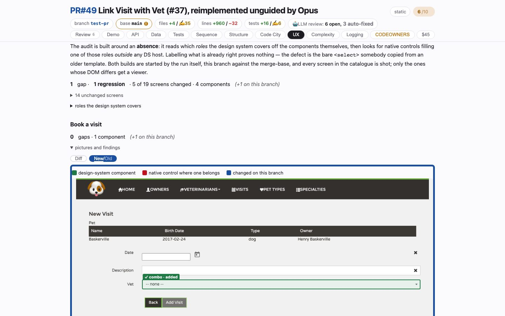

# UX
<!-- panel: dsaudit -->

> Native controls sitting where a design-system component belongs — a finding made of an *absence*, which a passing Playwright suite cannot produce.

<!-- shot:begin -->
<!-- generated by `skills/human-review/scripts/readme-tour.py` on every publish of the featured snapshot — edits between these markers are overwritten -->

[Open this tab in the live demo](https://victorrentea.github.io/human-review/demo/review.html#dsaudit) · [all tabs](../../README.md#a-tour-one-tab-at-a-time)
<!-- shot:end -->

## What you see

- **The verdict** — gaps, regressions, how many screens changed, how many DS components.
- **Every changed screen, before and after** — design-system components outlined green,
  native controls filling a role the design system covers outlined red, what this branch
  changed outlined blue.
- **Unchanged screens** are named in one line: every screen in the app's catalogue is shot,
  and only those whose DOM differs get a viewer.

The defect it hunts is the bare `<select>` somebody copied from an older template: it looks
close enough that review slides straight past it.

## What it needs

- **Playwright**, **numpy**, and both revisions served — the run starts the branch and the
  merge-base side by side.
- The app's screen catalogue in `human-review.json`, and `data-ds="<name>"` on your
  design-system hosts.

## Deeper

- [The design-system audit](../../README.md#the-design-system-audit)
- Produced by [`ds-audit.py`](../../skills/human-review/scripts/ds-audit.py)
